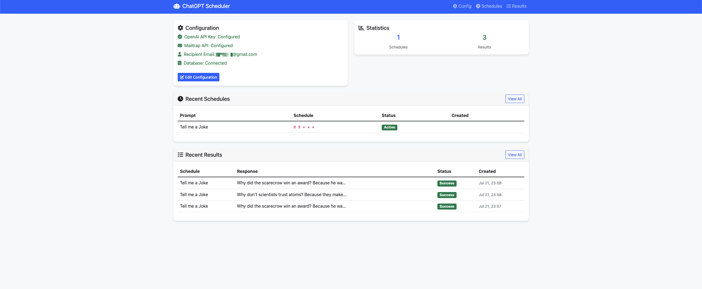

# ChatGPT Scheduler



Welcome to ChatGPT Scheduler! This app lets you schedule prompts for OpenAI's ChatGPT, view results in a dashboard, and receive them by email. It's built with Spring Boot, PostgreSQL, and Mailtrap for email delivery.

## Features
- Schedule prompts to ChatGPT and get results automatically
- Dashboard to view and manage schedules and results
- Email delivery of results
- Easy web-based configuration for API keys, email, and database

## Quick Start

### 1. Clone the repository
```bash
git clone https://github.com/omr1k/chatgpt-scheduler.git
cd chatgpt-scheduler
```

### 2. Configure the application
- Copy the template configuration file:
  ```bash
  cp src/main/resources/application-template.properties src/main/resources/application.properties
  ```
- Open `src/main/resources/application.properties` and fill in your own database, email, and API credentials.

### 3. Run the application
```bash
./mvnw spring-boot:run
```
- The app will be available at [http://localhost:8080](http://localhost:8080)

### 4. Set up your configuration in the app
- Go to [http://localhost:8080/web/config](http://localhost:8080/web/config)
- Enter your OpenAI API key, email, Mailtrap token, and database info
- Save the configuration and start scheduling prompts!

## Configuration Details
- **OpenAI API Key**: Needed to access ChatGPT
- **Mailtrap API Token**: For sending emails (get one at [Mailtrap](https://mailtrap.io/))
- **Database**: PostgreSQL connection info
- **Recipient Email**: Where results will be sent

## Need Help?
If you have any questions or issues, feel free to open an issue on GitHub.

## License
MIT

## Credits
- [Spring Boot](https://spring.io/projects/spring-boot)
- [OpenAI Java SDK](https://github.com/TheoKanning/openai-java)
- [Mailtrap](https://mailtrap.io/)

---

*This project is for personal use and learning. Not affiliated with OpenAI.* 